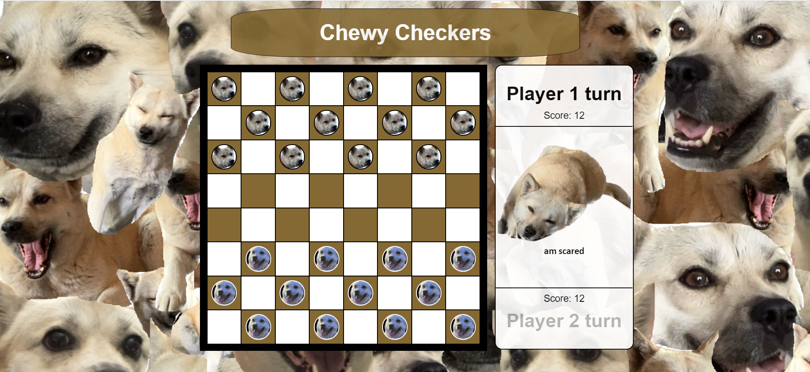
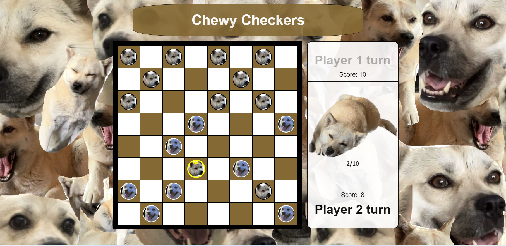
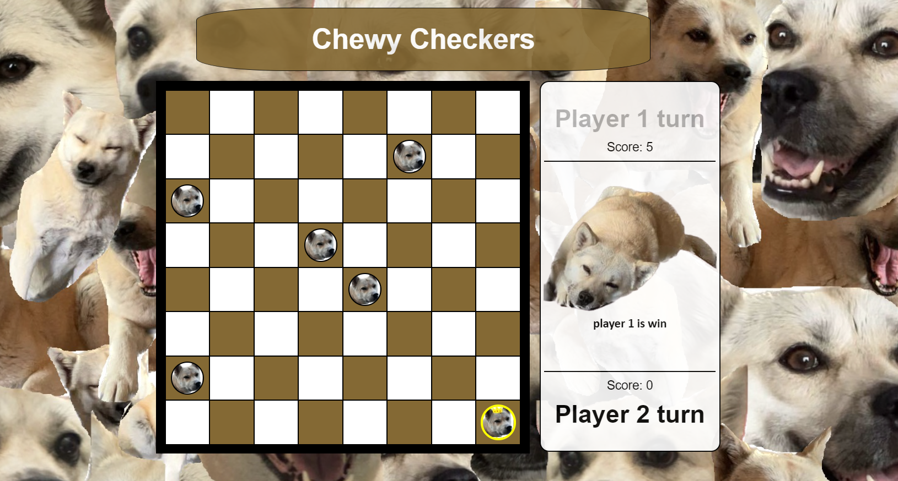

# Chewy Checkers

# Description
Welcome to Chewy Checkers! This is a two player game played on a single browser, where each will take a turn one after another. The objective of the game is to capture all of the other player's pieces, and whoever is the last remaining wins! 

Each player will begin with 12 pieces, which they can move diagonally on the dark squares on an 8x8 checkered board. Players can capture each each other's pieces by jumping diagonally. Players can only move forward however, if a player is succesfully able to get one of their pieces to the opposite end of the board, that piece becomes a king and can move backwards. Once one of the players emerges victorious, it will be game over.

BUT... this is no regular game of checkers... this is Chewy Checkers. In addition to being doge themed, Chewy will be judging your every move with mildly condescending comments until it witnesses the demise of one side.

# Gameplay
Beginning of the game

Some action

End game

# Technologies used
- HTML
- CSS
- Javascript
- Google Drawings
- Microsoft Paint

# Getting started
planning.md

Rules:
- Player 1 and 2 take turns moving their pieces
- Players can only move pieces forward and diagonally, on the dark squares
- Players can move their pieces over their opponents pieces to capture them and permanently remove them from play
- If a player is able to move one of their pieces to the opposite end of their board, that piece becomes a king and is now able to move backwards
- Once a player is able to capture all of their opponent's pieces, the game is over and the player with pieces remaining on the board is the winner
