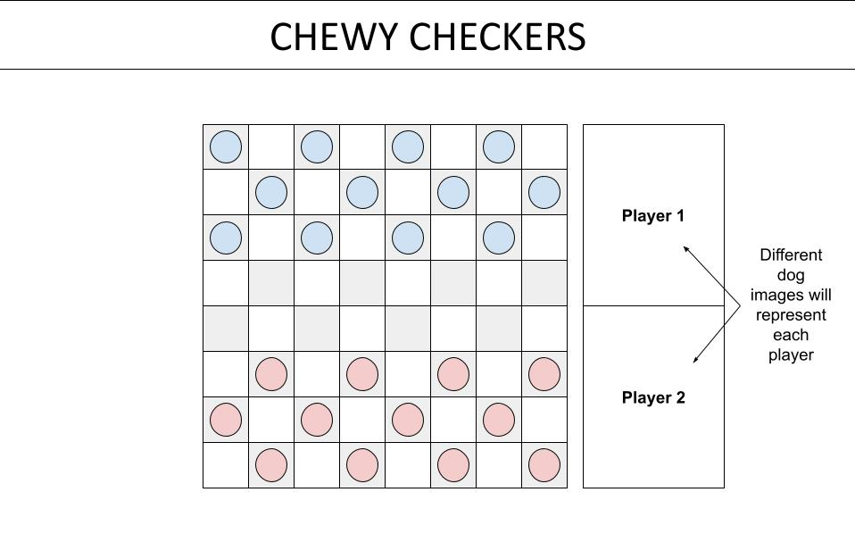
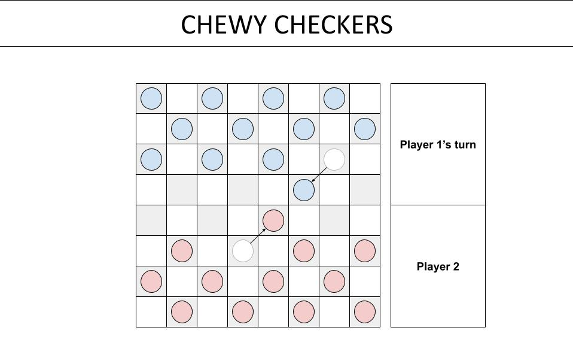
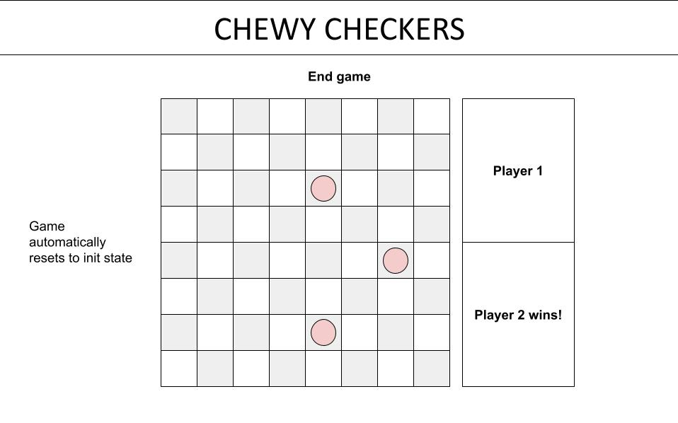

# Checkers

# Wireframes
 

 

 

# Pseudocode
**Constants**
const board =[
{1,null,2,null,3,null,4,null}
{null,5,null,6,null,7,null,8}
{9,null,10,null,11,null,12,null}
{null,13,null,14,null,15,null,16}
{17,null,18,null,19,null,20,null}
{null,21,null,22,null,23,null,24}
{25,null,26,null,27,null,28,null}
{null,29,null,30,null,31,null,32}
]

const chewyPhrases = {'zzz'}, 'k', 'mediocre at best}

The 8x8 board is an array of 64 objects. Half of those objects are undefined -> chess pieces cannot move there

**State variables**
let currentPlayer;
let chewyPhrases;

**Cached elements**
const p1PieceEl = document.querySelector('.p1-piece')
const p2PieceEl = document.querySelector('.p2-piece')
const invalidTileEl = document.querySelector('.invalid-tile')
const playTileEl = document.querySelector('.play-tile')
const p1KingEl = document.querySelector
const p2KingEl = document.querySelector

**Event listeners**
p1PieceEl on click move
  - Target piece to be moved 
  - Click on square piece is to be moved to
  - Function to check if move is valid/invalid
  - Function to check if transform to king

p2PieceEl on click move
  - Target piece to be moved 
  - Click on square piece is to be moved to
  - Function to check if move is valid/invalid
  - Function to check if transform to king

p1KingEl on click move
  - Target piece to be moved 
  - Click on square piece is to be moved to
  - Function to check if move is valid/invalid as a king

p2KingEl on click move
  - Target piece to be moved 
  - Click on square piece is to be moved to
  - Function to check if move is valid/invalid as a king

**Functions**

Init -> initial game state, calls render
Render -> 
regularValidMove ->
  - If piece is on an even array, can move piece to a tile of where the value has a difference of 3 or 4 -> move piece
  - Else if piece is on an odd array, can move piece to a tile of where the value has a difference of 4 or 5 -> move piece
  - Else if piece is on any array and moves to a tile of where the value has a difference of 7 or 9 and opposing player piece is on valid move, remove piece on valid move and move piece

  - If piece placed on null value -> invalid move

playerTurn -> text of game-stat box on right to indicate which player is active

transformKing ->
  - If piece placed on opposite array, transform to king

kingValidMove ->

endGame ->
  - If all p1Pieces OR p2Pieces are removed OR p1/p2 cannot make a valid move -> end game
  - Else, game continues
